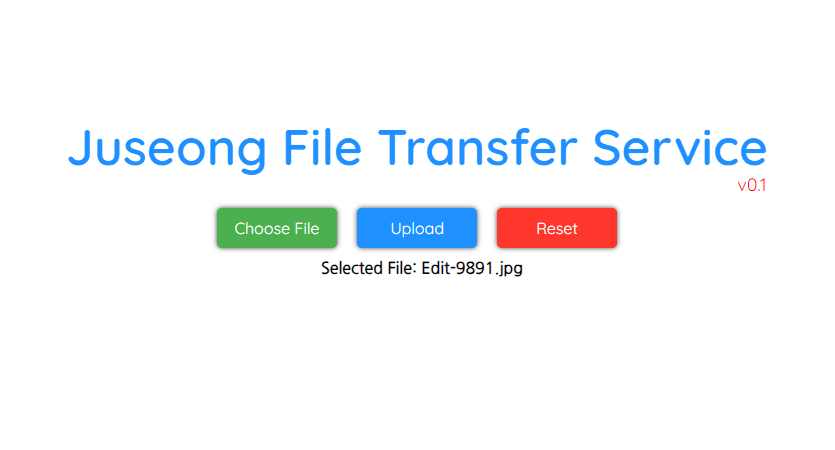

# Juseong File Transfer Service

# Description

A program that facilitates the easy setup of a server to receive files.

카톡파일전송 300MB제한에 드라이브도 용량이 거의 다 찼는데 용량 좀 큰 파일을 보내려니 마땅히 방법도 없고 열받아서 만들었습니다.

### Function(buttons)

- **Choose File(for transfer)**
- **Transfer**
- **Reset(Page Refresh)**

# How to build

```bash
go build
```

빌드는 간단히 위와 같고, 빌드시 filetransfer 이름의 실행파일이 생성(확장자는 OS에따라 다름)

# How to start server

```sh
#ubuntu
./filetransfer --port=[portnumber(optional)]

#windows
.\filetransfer.exe --port=[portnumber(optional)]
```

포트번호는 선택사항이며, default는 8080으로 세팅되어있다.  
Windows의 경우, 터미널 사용하지 않고, exe파일을 gui환경에서 클릭해서 바로 실행해도 무관.  
→ 이 경우, 빌드과정 없이 Release에서  exe파일을 바로 다운받아 실행가능  


실행 후 웹브라우저를 통해 본인ip:8080 또는 localhost:8080 으로 접속하면 위와같은 페이지 확인가능  
해당 페이지가 확인되면, <본인ip:포트번호>를 상대방에게 알려주어 파일을 전송받을 수 있다.

# How to use this service

1. 위의 사진의 메인 페이지에서 Choose File을 선택해 파일탐색기에서 전송할 파일을 찾는다. (파일은 한번에 하나씩만 전송가능함)
2. 전송할 파일이 선택되면 아래와 같이 Selected File: 로 선택된 파일명이 표시된다. 이를 보고 자신이 보낼 파일이 맞는지 확인한다. 



3. 전송할 파일을 확인했다면, Upload버튼을 눌러 서버를 작동중인 상대에게 파일을 전송한다. 주의할 점은, Upload버튼을 한번 누른 후 “Upload Complete”라는 대화창이 출력될 때 까지 버튼을 여러번 누르지 않고 대기해야한다. 

### *Caution*

여기서 파일을 전송하는데 사용되는 프로토콜은 HTTP이다. 패킷 암호화를 지원하지 않으므로, 개인정보 등 민감한 정보를 포함하는 데이터를 전송하지 않도록 주의해야한다.