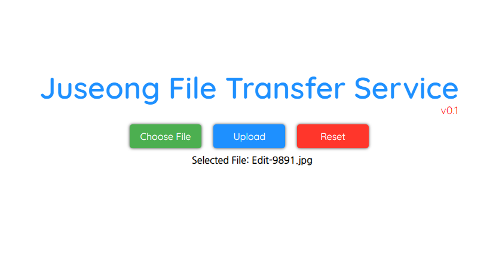

# Juseong File Transfer Service

This project supports multiple languages. Please select another language.  

- [한국어](README.md)

# Description

A program that facilitates the easy setup of a server to receive files.  

カカオトーク転送300MB制限で、グーグルドライブの容量もいっぱいになって、少し大きなファイルを送ると当然方法がなくて腹が立ってこれを作りました。  

### Function(buttons)

- **Choose File(for transfer)**
- **Transfer**
- **Reset(Page Refresh)**

# How to build

```bash
go build
```

ビルドは簡単に上記のように行うことができます。ビルドする時、filetransferの名が実行ファイルが生成されます。（拡張子はOSによって異なる）  

# How to start server

```sh
#ubuntu
./filetransfer --port=[portnumber(optional)]

#windows
.\filetransfer.exe --port=[portnumber(optional)]
```

ポート番号はオプションであり、基本的に8080にセットされている。  
Windowsの場合、ターミナル使わず、exeファイルをGUI環境でクリックしてすぐ実行しても大丈夫。  
→この場合、ビルドなしでReleaseからexeファイルをすぐダウンロードして実行できる。  


実行の後、ウェブブラウザを通じて［本人IP:8080］や［localhost:8080］に接続すると上のようなペイジー確認可能。  
当ペイジーが確認されたら、［本人IP:ポート番号］を相手に知らせてファイルを転送を受けられる。  

# How to use this service

1. 上の写真のメインページからChoose Fileを選択し、ファイル探索機から転送するファイルを探す。 (ファイルは一度に一つずつだけ伝送可能)
2. 転送するファイルが選択されたら、下の絵のようにSelected File:　で選択されたファイル名が表示されてる。これを見て自分が送るファイルか確認する。



3. 転送するファイルを確認したら、Uploadボタンを押してサーバーを作動している相手にファイルを転送する。注意するべきことは、Uploadボタンを一度押した後、「Upload Complete」の案内が出力するまでボタンを何度も押せず待たなきゃいけない。


### *Caution*

ここでファイルを転送に使われてるプロトコルはHTTPで、パケット暗号化をサポートしていないので、個人情報などの機密情報を含めるデータを転送しないように注意しなきゃいけない。

---
**翻訳内容について修正contribution歓迎**